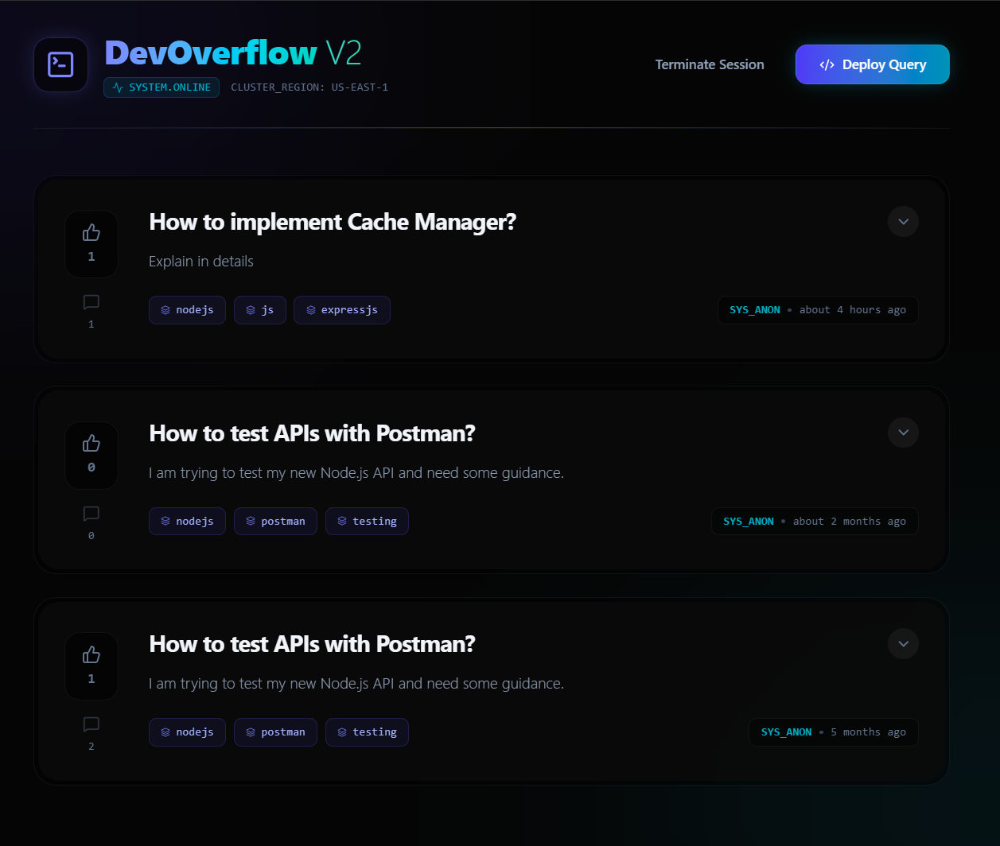

# DevOverflow V2 | High-Concurrency Q&A Infrastructure 🧠⚡



DevOverflow V2 is a production-grade, highly concurrent Q&A platform architecture. While the project includes a modern Next.js frontend, the primary engineering focus is on the **Backend Infrastructure**—specifically designed to handle race conditions, optimize read latency, and offload heavy computations from the Node.js event loop.

## 🚀 Architectural Highlights

This project was built to solve specific scaling challenges inherent in high-traffic applications:

* **Zero-Downtime Data Integrity:** Implemented **MongoDB ACID Transactions** for the voting system. When a user upvotes, the answer score and the author's reputation are updated atomically, eliminating race conditions during traffic spikes.
* **Microsecond Read Latency:** Engineered a custom **Redis Caching Layer** (`ioredis`) for feed and search endpoints, dropping response times from ~150ms to ~2ms. Includes automated cache-invalidation strategies upon write operations.
* **Event-Driven Async Processing:** Integrated **BullMQ** (Redis-backed message queue) to offload heavy operations (e.g., email notifications, tag aggregations) to background worker processes, freeing up the main Express thread to handle concurrent HTTP requests.
* **Optimized Execution Plans:** Migrated away from linear `$regex` DB scans by implementing **MongoDB Compound Text Indexes** with weighted relevance scoring for ultra-fast, scalable search.
* **Enterprise Observability:** Built a centralized error-handling pipeline integrated with **Winston**, ensuring graceful failure handling, consistent JSON API responses, and persistent logging of stack traces and latency metrics.
* **Controller-Service-Repository Pattern:** Strictly decoupled HTTP routing, business logic, and database operations to ensure high testability and prepare the architecture for future microservice extraction.

## 🛠️ Tech Stack

**Backend (Core Focus)**
* **Runtime:** Node.js, Express.js
* **Database:** MongoDB (Atlas), Mongoose ODM (Transactions & Indexing)
* **Caching & Queues:** Redis, BullMQ
* **Observability:** Winston, Morgan
* **Security:** JWT Authentication, Helmet, Express Rate Limit

**Frontend (Client Consumer)**
* **Framework:** Next.js (React)
* **Styling:** Tailwind CSS v4 (Glassmorphism UI)
* **Features:** Advanced Optimistic UI updates to mask network latency.

## ⚙️ System Design

### The Controller-Service Pattern
By isolating business logic into Services, the application remains modular.
```
// Example: The Controller handles HTTP, the Service handles the ACID Transaction
exports.toggleUpvote = catchAsync(async (req, res, next) => {
    // 1. Offload complex logic to the Service layer
    const upvoteCount = await questionService.toggleUpvote(req.params.id, req.user);
    // 2. Respond to the client immediately
    res.status(200).json({ status: 'success', upvotes: upvoteCount });
});
```

## Background Workers (BullMQ)
Instead of making users wait for heavy tasks to complete, the API instantly returns a 200 OK while pushing jobs to Redis for asynchronous processing.

```
// Event-Driven Queue implementation in the Answer Controller
await notificationQueue.add('sendNewAnswerNotification', {
    questionId: updatedQuestion._id,
    answerContent: content,
    userId: req.user
});
```

 

## 💻 Local Setup & Deployment
To run this highly scalable infrastructure on your local machine:

### 1. Clone the repository

```
git clone [https://github.com/vivekTiw120303/DevOverflow.git](https://github.com/vivekTiw120303/DevOverflow.git)
cd DevOverflow
```

### 2. Install Dependencies
This project operates as a monorepo. You need dependencies for both environments.

```
# Install root dependencies
npm install

# Install backend dependencies
cd backend && npm install

# Install frontend dependencies
cd ../frontend && npm install
```

### 3. Environment Configuration
Create a .env file in the root directory:

```
MONGO_URI=your_mongodb_atlas_connection_string
JWT_SECRET=your_super_secret_jwt_key
PORT=5000
REDIS_HOST=127.0.0.1
REDIS_PORT=6379
```
Note: MongoDB Transactions require a Replica Set. If testing locally without Atlas, ensure your local MongoDB is configured as a replica set using run-rs.

### 4. Spin up the Infrastructure
Ensure your local Redis server is running. Then, use the root command to concurrently launch both the Next.js UI and the Node API.

```
# Runs both frontend (Port 3000) and backend (Port 5000) simultaneously
npm run dev
```

 

## 📖 API Documentation
The API follows strict RESTful principles and centralized JSON error formatting. Authenticated routes require a valid JWT passed in the Authorization: Bearer <token> header.

### Authentication (```/api/auth```)
● ```POST /register``` - Provision a new user account.

● ```POST /login``` - Authenticate and retrieve JWT payload.

### Questions (```/api/questions```)
● ``` GET / ``` - Retrieve paginated feed (⚡ Redis Cached)

● ``` POST / ``` - Publish a new question (🔒 Auth Required | 🧹 Invalidates Cache)

● ```POST /:id/answer``` - Append an answer (🔒 Auth Required | 📬 Triggers BullMQ Worker)

● ```POST /:id/upvote``` - Toggle upvote state (🔒 Auth Required | 🔄 MongoDB ACID Transaction)

● ```GET /tag/:tag``` - Retrieve questions by tag (⚡ Redis Cached)

● ```GET /search/:keyword``` - Execute Full-Text Index search (⚡ Redis Cached)

---

Architected and engineered by Vivek Tiwari.
